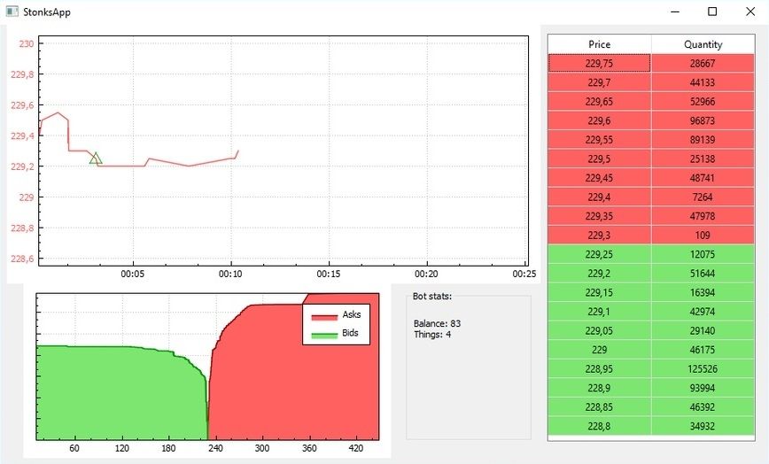
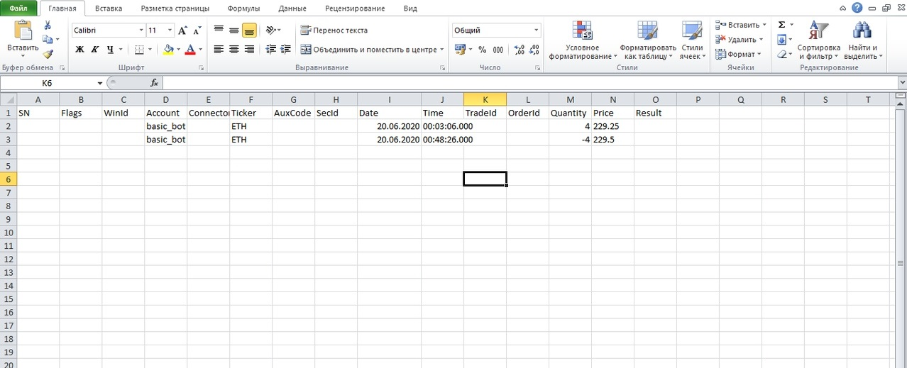

# StonksApp

Репозиторий с перезаливом проекта для учебной практики в ПсковГУ в 2020.

## Что это такое?

Qt-приложение, парсящее файл с данными о торгах на бирже Deribit, плавно визуально пролистывая ход торгового дня.

Одновременно на этих данных работает примитивный торговый бот.

Внизу окна показывается состояние его счёта, а на графике отмечаются моменты покупки и продажи.

Помимо графика, его решения логируются в .csv таблицу.

## Как собрать

* Обязательно Visual Studio, потому что используется её система сборки
* Скачать Qt (мы использовали 5.15.0)
* В студии установить расширение Qt VS Tools
* Прописать в нём путь до Qt

Ещё мы используем библиотеки QCustomPlot и rapidjson, они лежат прямо в сорсах.

## Как использовать

* Достать с Deribit дамп с данными за какой-то торговый день (не помню как, надо читать https://docs.deribit.com)
* В мэйне захардкодить имя этого файла (мы всё гоняли на одном, нам можно)
* Захардкодить в мэйне имя инструмента, с которым будем работать (мы всё гоняли на одном, нам можно)
* Кстати, в логгере имя "ETH" захардкожено независимо от мэйна

## Участники

* **Антон Демин** - [ShinokuS](https://github.com/ShinokuS)
* **Дмитрий Александров** - [Expurple](https://github.com/Expurple)
* **Илья Матвеев** - [Accel1215](https://github.com/Accel1215)
